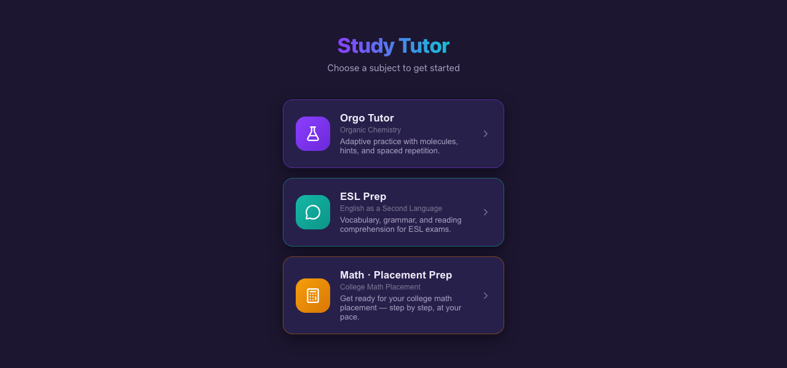
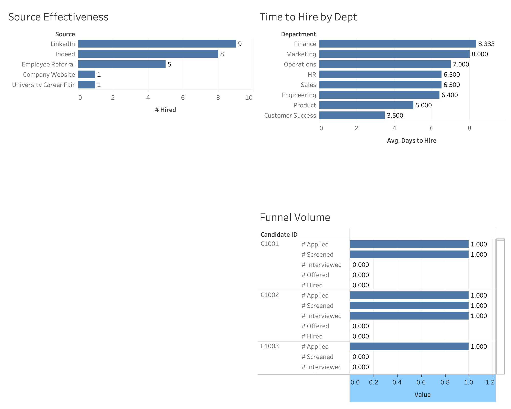
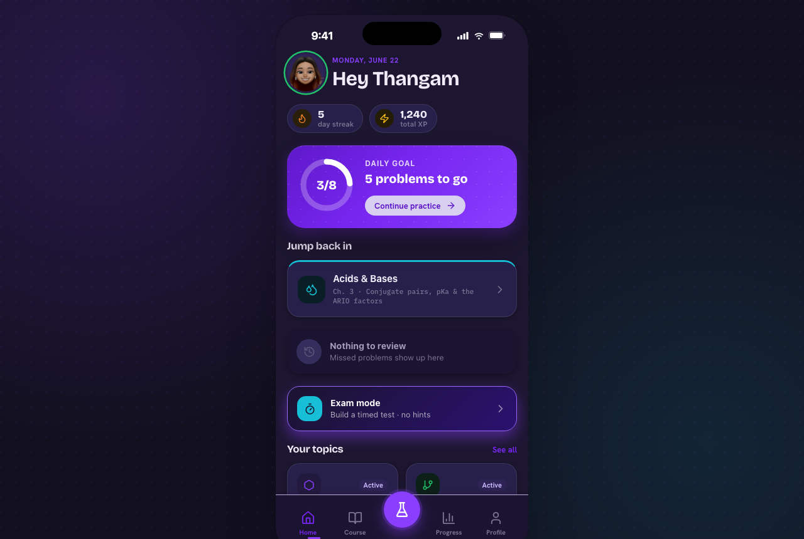

# Akaash Vincent

**AI × HR Technology · People Analytics · I-O Psychology**

[LinkedIn](https://www.linkedin.com/in/akaash-vincent-548013338/) · akaashvincent@gmail.com

I build AI tools for HR and people teams, grounded in industrial-organizational psychology. Currently an HR
technology intern at an employee-owned architecture firm, and starting a part-time M.A./M.S. in I-O Psychology
in 2027. Most of my professional work is private, so a few representative projects are below.

## Featured projects

### StudyTutor — adaptive study platform
A two-user adaptive learning app that tailors practice to each learner. Built and shipped to production. One
user raised an organic-chemistry grade from a C- to a 94%, and another scored 294 LOEP and 267 ACCUPLACER on
placement tests.
**Tech:** React, Vite, JavaScript, Firebase, Vercel. **Live demo:** https://mystudytutor.vercel.app

### Recruiting Funnel Analysis Dashboard
An end-to-end recruiting-analytics pipeline on a 300-candidate dataset. Surfaced a 49% screen-to-interview
drop-off as the top bottleneck, showed LinkedIn and Indeed driving 71% of hires, and broke down a 2.4x
time-to-hire variance across departments.
**Tech:** Excel, Tableau, Python.

### Design-Studio / Product-Studio — multi-agent build pipelines
Reusable multi-agent pipelines that move an idea through concept, build, and review stages to produce working
UIs and product plans. Used to ship StudyTutor and other projects. Concept and sample outputs shown here;
internals kept private.
**Tech:** Claude Code, multi-agent orchestration.

### Dyslexia in the Workplace — I-O research
A 2×2 factorial study (n=200 employed adults) on reading accommodations. Found a significant
Dyslexia-by-Condition effect on reading speed (F(1,151)=13.32, p<.001) and a workplace-competence gap
(t(153)=2.22, p=.03). Presented at the Eastern Psychological Association 2026 conference.
**Tools:** Qualtrics, Excel, factorial ANOVA.

## Skills
AI application development (Claude API, Codex, structured outputs, prompt caching), full-stack prototyping
(Python, Flask, React), people analytics (Excel, Tableau, SQL, Qualtrics), and HR systems (Oracle Fusion
Cloud HCM, SAP SuccessFactors, Workday, Greenhouse, SharePoint, Copilot).

---

Some professional work, including AI HR products built during my internship, is confidential. Happy to walk
through it on request.
