

# Akaash Vincent

**AI × HR Technology · People Analytics · I-O Psychology**

[LinkedIn](https://www.linkedin.com/in/akaash-vincent-548013338/) · akaashvincent@gmail.com

I build AI tools for HR and people teams, grounded in industrial-organizational psychology. I'm an HR
technology intern at an employee-owned architecture firm, and starting a part-time M.A./M.S. in I-O
Psychology in 2027. Most of my professional work is private, so a few representative projects are below.

**Jump to** · [StudyTutor](#studytutor) · [Recruiting analysis](#recruiting) · [L&D Agent](#ld-agent) · [Design pipeline](#design) · [Research](#research) · [DJ Stage Show](#dj) · [Skills](#skills)

---

## StudyTutor: adaptive study platform · [live demo](https://mystudytutor.vercel.app)

Students practice with tools that never adapt to what they keep getting wrong. StudyTutor grades each answer,
explains the reasoning, and spaces repetition toward the gaps. I built and shipped it across organic
chemistry, ESL, and college math placement.

- One user raised an organic-chemistry grade from a C- to a 94%.
- Others used it to prep for college ESL and math placement (294 LOEP, 267 ACCUPLACER).
- Live in production. The triptych and clip below are the real app, not mockups.

**Built with** React, Vite, JavaScript, Firebase, Vercel.

  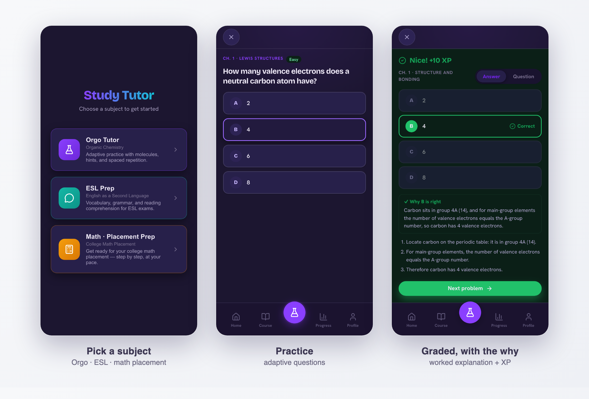

  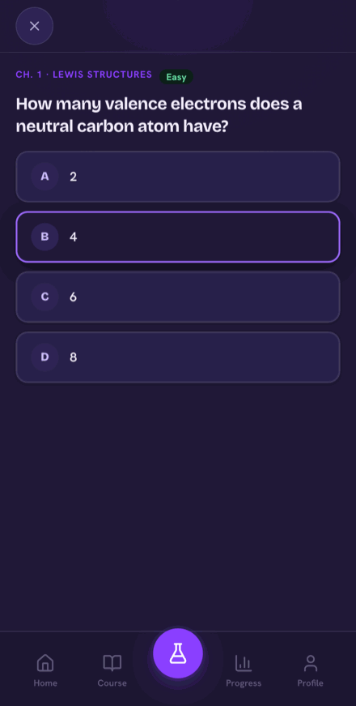

<em>The live app: pick a subject, answer, and get graded with a worked explanation and spaced review.</em>

  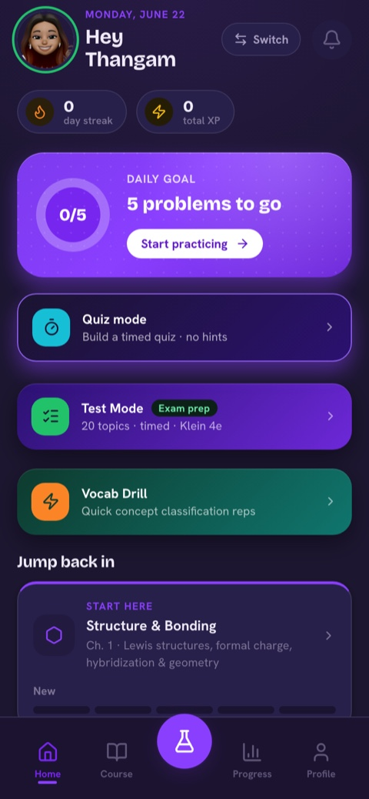
  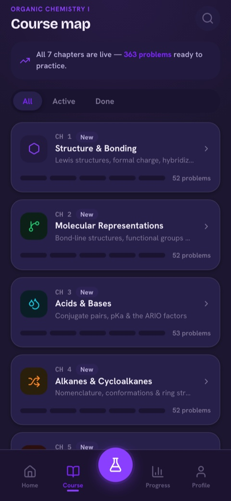
  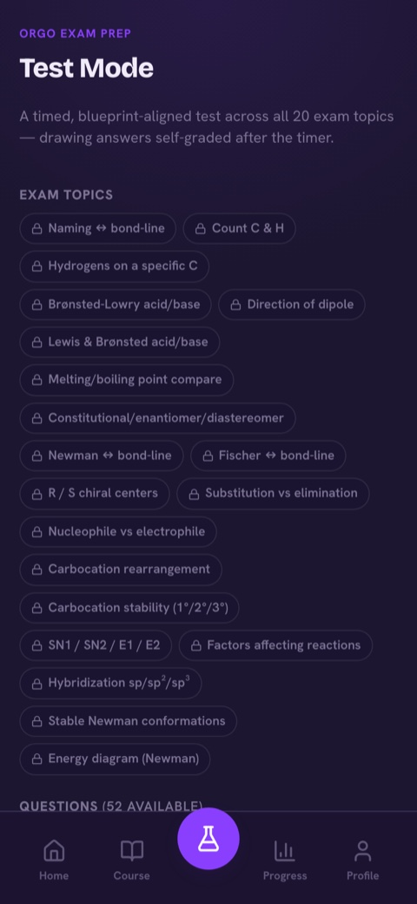

<em>More of the app — a goal-driven home, a 7-chapter course map (363 problems), and timed exam prep.</em>

<a href="#top">↑ back to top</a>

---

## Recruiting funnel analysis

A 300-candidate recruiting funnel was leaking, and the bottleneck was not obvious. I analyzed it in Excel,
Tableau, and Python, then rebuilt the findings as the dashboard below.

- The structural bottleneck: 49% of screened candidates never reached an interview.
- LinkedIn and Indeed together drove 71% of hires.
- Time-to-hire ran 2.4 times longer in Engineering than in Sales.

**Built with** Excel, Tableau, Python. Dashboard rebuilt for presentation with representative figures.

  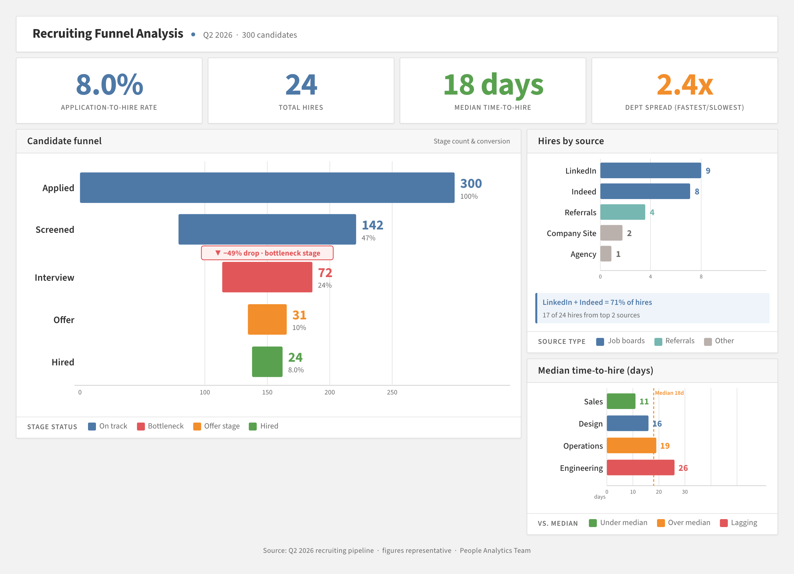

<em>Built in Tableau: the funnel, source mix, and time-to-hire on one canvas. The red stage marks the screen-to-interview bottleneck.</em>

<a href="#top">↑ back to top</a>

---

## L&D Agent: AI onboarding for specialty hiring · concept demo

Specialty architecture firms often can't hire architects with direct experience in their niche — the talent
sits one specialty over, in adjacent work. Every adjacent hire then means a senior architect building a
training program from scratch, so the hire frequently doesn't happen. The L&D Agent reads a candidate's
background, maps it to the firm's competency framework, and generates a gap analysis and a phased,
mentor-reviewed onboarding plan — so the specialty gap becomes closeable without burning senior time.

- Maps a résumé to a 10-competency framework, scores hiring readiness, and separates critical gaps from
  transferable strengths.
- Generates a phased ramp plan with review gates, senior sign-offs, and an estimated time-to-billable.
- Role-aware: an HR/talent-acquisition lens and a design-leadership lens read the same candidate differently.
- Grounded Q&A: a knowledge base of practice knowledge rides in the prompt as a cached prefix, so answers
  reflect the firm's own way of working.

**Built with** Claude API, Python, Flask, prompt caching, HTML, CSS, JavaScript.

  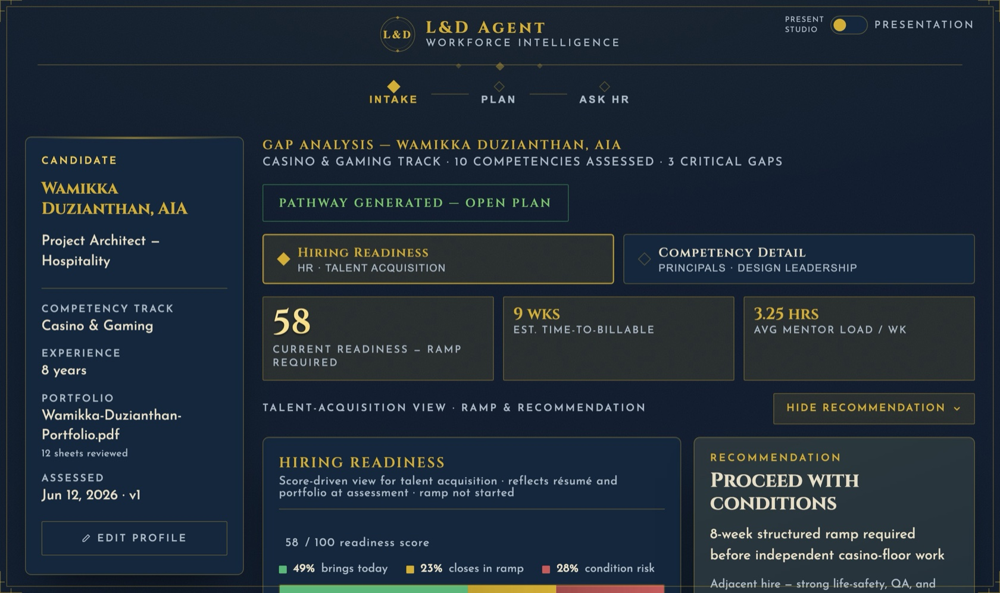

  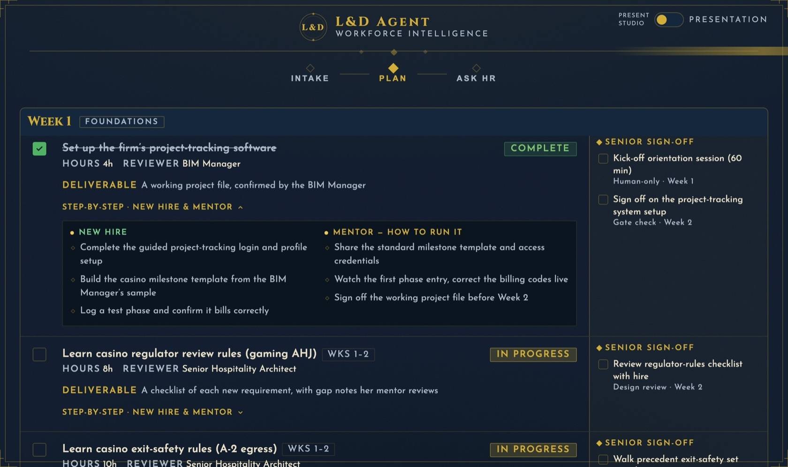

<em>A concept demo built for an employee-owned architecture firm; the firm and candidate are fictional. The agent maps a candidate to a competency framework, then generates a mentor-reviewed onboarding plan.</em>

  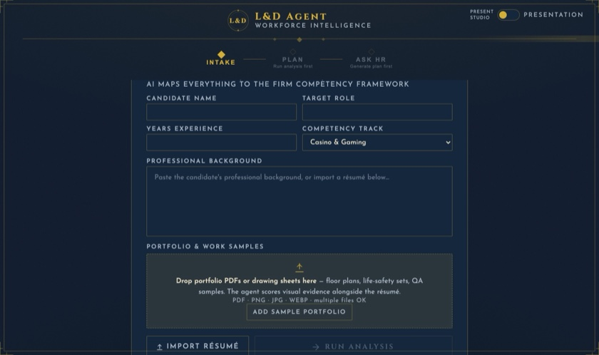
  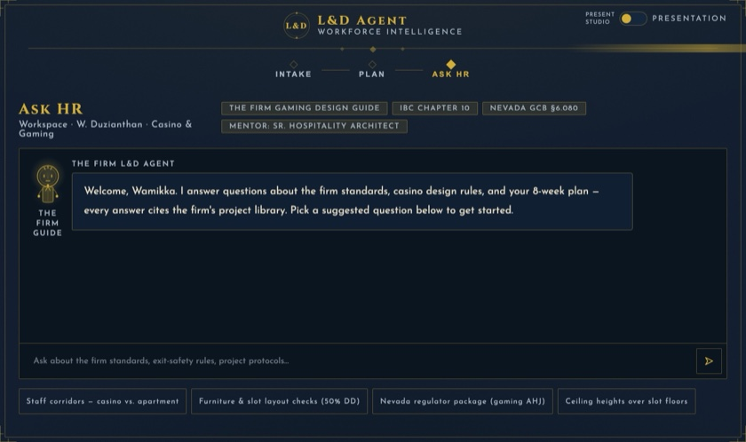

<em>The full pipeline — paste a background at intake, then a knowledge-grounded Ask-HR workspace where every answer cites its source.</em>

<a href="#top">↑ back to top</a>

---

## Design-studio: multi-agent UI pipeline · sample: an AI HR copilot

Taking a product idea to a working, on-brand interface usually means a designer, a developer, and several
rounds of review. I built a pipeline that turns a brief into a self-contained UI, with a concept gate up
front and a screenshot-armed critic before anything ships. Concept, build, and critique run as separate
agents.

The sample below is **Aria**, an Ask-HR copilot concept the pipeline produced. Every answer cites the policy
it came from and shows how confident it is.

- A design sample from the pipeline, not a shipped product.
- Built to show how I design AI-for-HR interfaces, my main focus.

**Built with** Claude Code, multi-agent orchestration, HTML, CSS, JavaScript.

  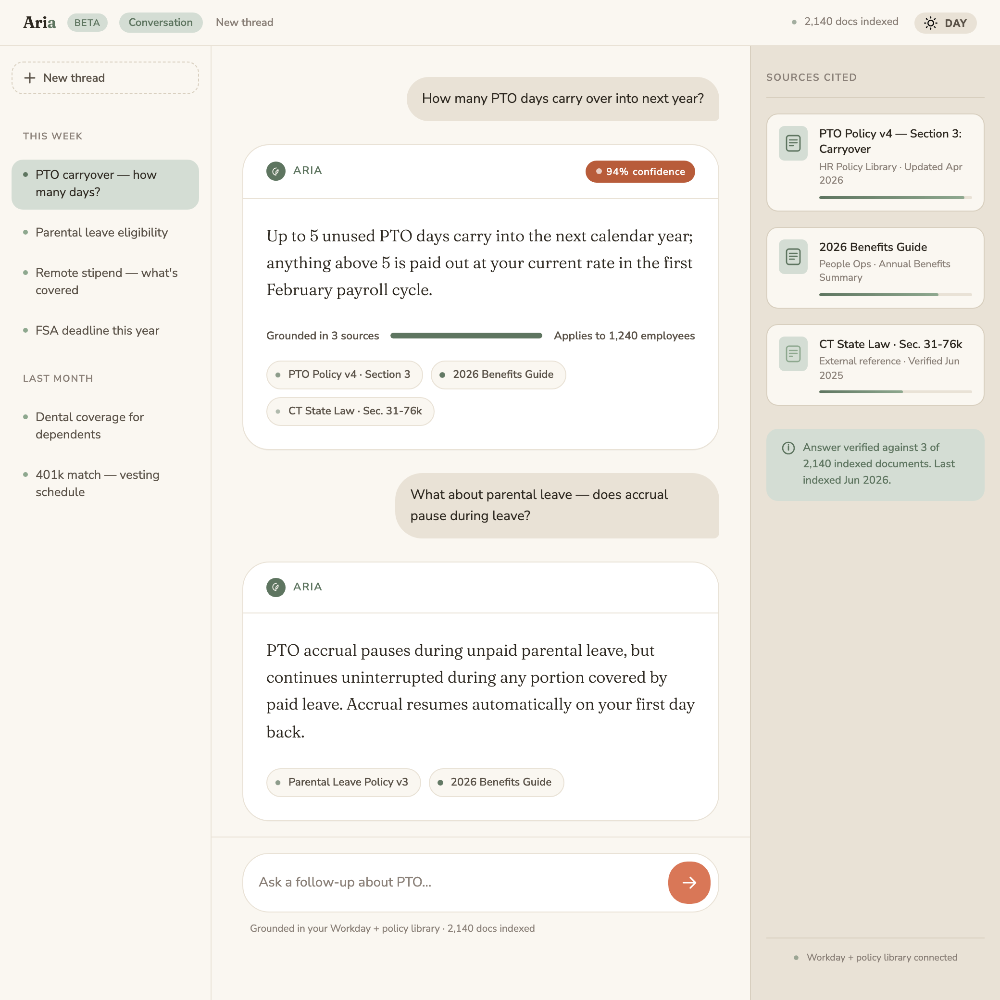

  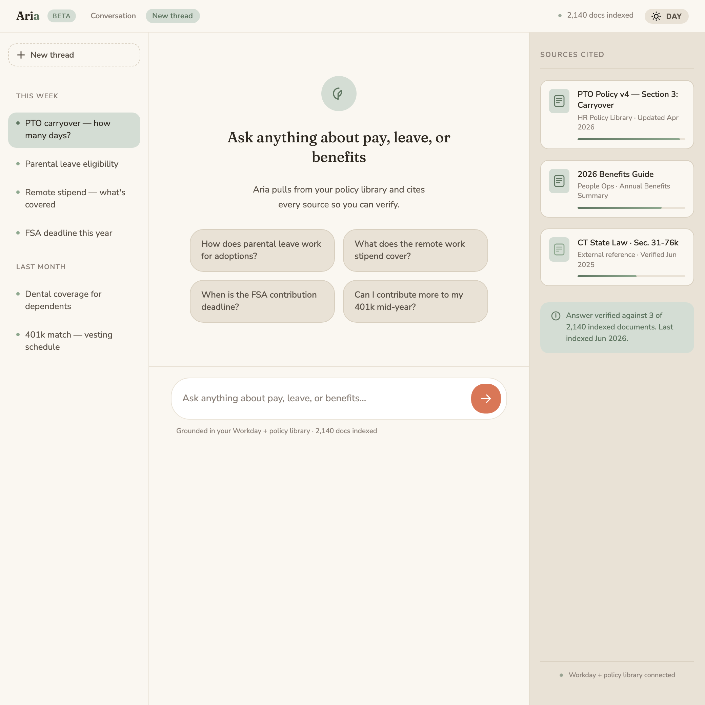

<em>Sample output. Aria answers HR questions and cites the policy behind each answer.</em>

<a href="#top">↑ back to top</a>

---

## Dyslexia in the workplace: I-O research

A 2×2 factorial study (n=200 employed adults) on reading accommodations. Found a significant
Dyslexia-by-Condition effect on reading speed (F(1,151)=13.32, p<.001) and a workplace-competence gap
(t(153)=2.22, p=.03). Presented at the Eastern Psychological Association 2026 conference.

**Tools** Qualtrics, Excel, factorial ANOVA.

  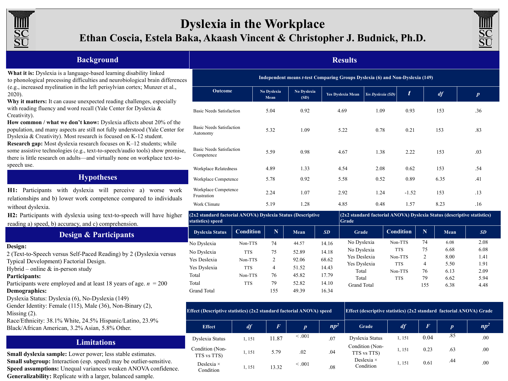

<em><a href="assets/dyslexia-poster.pdf">Full poster (PDF)</a> · Eastern Psychological Association, 2026</em>

<a href="#top">↑ back to top</a>

---

## DJ Stage Show: real-time performance visualizer

A live visual console I run at my DJ sets. It reads the playing track and the audio signal and renders a
dual-deck performance view — now-playing and cued decks, moving waveforms, BPM and key, and crossfade
timing — reacting to the music in real time. One self-contained HTML file, no backend, run from the booth.

- Run live at 5 paid events — weddings, parties, corporate — for crowds of 70 to 150, with repeat bookings.
- Reacts to the live audio signal (Web Audio API) and the currently-playing track from the Spotify API.
- Decks, platters, and album art render to canvas; the whole thing is a single file off a laptop.

**Built with** JavaScript, Web Audio API, Canvas, Spotify API.

  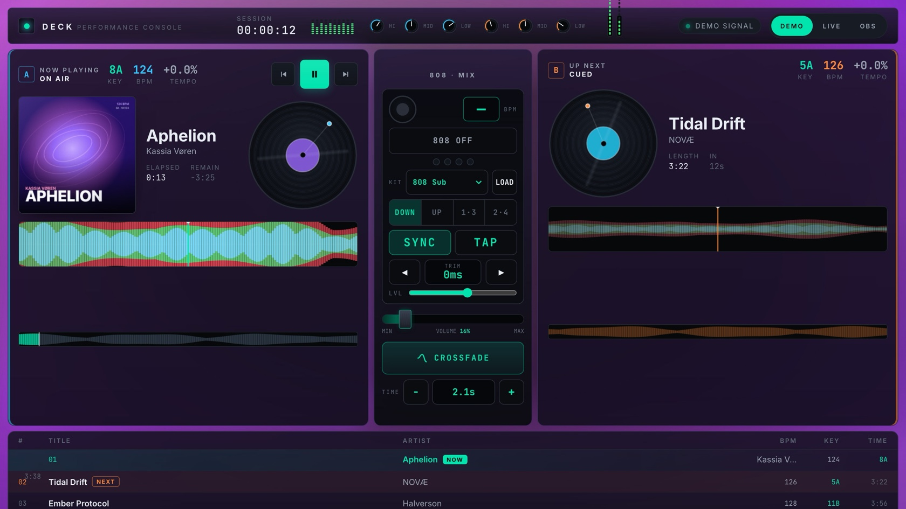

  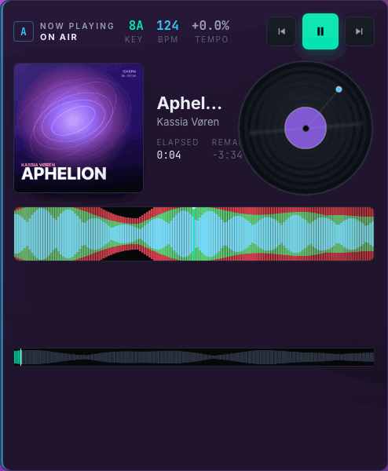

<em>The live console during a set — decks, moving waveforms, and crossfade timing, reacting to the track in real time.</em>

<a href="#top">↑ back to top</a>

---

<b>Skills &amp; tools</b> — AI application development · full-stack prototyping · people analytics · HR systems

 

AI application development (Claude API, Codex, structured outputs, prompt caching), full-stack prototyping
(Python, Flask, React), people analytics (Excel, Tableau, SQL, Qualtrics), and HR systems (Oracle Fusion
Cloud HCM, SAP SuccessFactors, Workday, Greenhouse, SharePoint, Copilot).

---

Some professional work, including AI HR tools built during my internship, is confidential. Happy to walk
through it on request.

<a href="#top">↑ back to top</a>

